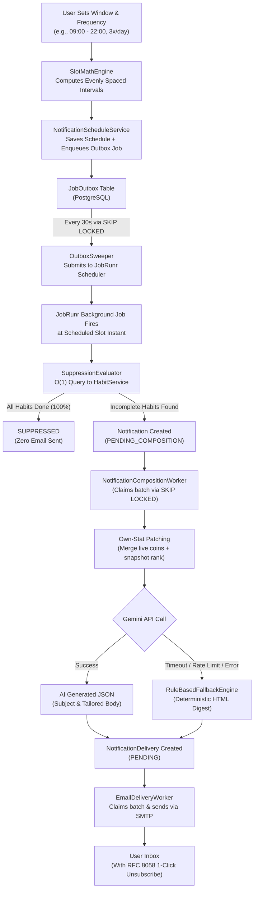

# Habition

Habition is a gamified, social habit-tracking application designed to help users build consistency through competition and self-accountability. Users can create shared Habit Groups, earn coins, build streaks, and compete against friends on dynamic leaderboards.

## Core Features

- **User Accounts & Profiles**: Unique username-based public profiles with personal standalone streak and heatmap tracking.
- **Habit Groups & Competitions**: Create or join groups via unique invite codes. Admins can set time-bound competitions to automatically declare winners.
- **Advanced Gamification**: Earn coins for logging daily task completions and hitting streak milestones. Watch a satisfying 3D spinning coin animation when checking off habits!
- **Dynamic Leaderboards**: Real-time coin ranking and competition timers within your groups.
- **Social Connectivity**: 
  - Manage a Friends List and send direct messages.
  - Chat in real-time within your Habit Groups or directly with strangers discovered on the platform.
  - Filter your active conversations with a sleek, mobile-responsive search bar.
  - Maintain privacy by instantly clearing 1:1 chat histories.
- **Advanced Discovery & Search**: 
  - Powered by **Meilisearch** for blazing fast full-text search.
  - **Jaccard Similarity Re-ranking**: Search results are intelligently re-ranked based on overlapping interests and tags.
  - **Geo Soft-Boosting**: Uses exponential decay haversine logic to prioritize groups and users geographically closer to your configured location.
- **Interactive Map Configuration**: Set up your location via an interactive map for highly tailored geo-matching.
- **Robust Group Management**: Admin assignments, pending join request queues, outgoing request tracking, deleting, and leaving groups.

## Tech Stack

- **Frontend**: React, TypeScript, TailwindCSS, Vite
- **Backend**: Java, Spring Boot (Microservices Architecture)
- **Database**: PostgreSQL
- **Search Engine**: Meilisearch

## Getting Started (For Beginners)

To run Habition on your local machine, you need to set up Meilisearch (our search engine), the Backend (Java/Spring Boot), and the Frontend (React).

### 1. Setup Environment Variables
First, you need to create an environment file in the backend directory. This file will store your secret keys and database configurations.
1. Navigate to the `backend` folder.
2. Create a new file named `.env`.
3. Add the following required variables to your `.env` file:
   ```env
   # Database connection
   DB_URL=jdbc:postgresql://localhost:5432/habition_users
   DB_USERNAME=postgres
   DB_PASSWORD=your_postgres_password
   
   # JWT Secret (Any secure random string)
   JWT_SECRET=404E635266556A586E3272357538782F413F4428472B4B6250645367566B5970
   
   # Mail Configurations (Needed for OTP emails)
   SPRING_MAIL_USERNAME=your_email@gmail.com
   SPRING_MAIL_PASSWORD=your_app_password
   
   # Meilisearch Setup (Mandatory)
   MEILISEARCH_HOST=http://localhost:7700
   MEILISEARCH_API_KEY=your_meilisearch_master_key
   ```
*(You will get the `MEILISEARCH_API_KEY` in the next step.)*

### 2. Setup Meilisearch
Meilisearch is mandatory for the app's advanced discovery features. We have provided setup scripts that automatically fetch the latest release of Meilisearch for your operating system and architecture into a `meilisearch/` folder.

**Windows**:
```bash
.\setup-meilisearch.bat
```
**Mac/Linux**:
```bash
chmod +x setup-meilisearch.sh
./setup-meilisearch.sh
```

**Starting Meilisearch:**
After running the script, the latest executable will be downloaded to the `meilisearch/` folder. You must start the engine:
```bash
cd meilisearch
# For Windows:
.\meilisearch.exe --master-key SBRmZ0tKs_Y1i3gQgH1aIZ6YI0LRojaqjSCI2yjUD-8

# For Mac/Linux:
./meilisearch --master-key SBRmZ0tKs_Y1i3gQgH1aIZ6YI0LRojaqjSCI2yjUD-8
```
> **IMPORTANT:** When you start Meilisearch, it will display a master key (or you can use the one passed in the command above). Make sure you copy this key and set it as `MEILISEARCH_API_KEY` in your `backend/.env` file!

### 3. Run Backend Services
Next, you need to start the Java microservices. Open a **new terminal window** (keep Meilisearch running in the other one) and run:
```bash
cd backend
.\start-services.bat   # For Windows
./start-services.sh    # For Mac/Linux
```

### 4. Run Frontend App
Finally, start the React application. Open another **new terminal window** and run:
```bash
cd frontend
npm install
npm run dev
```

## Architecture Highlights

- **Microservices Architecture**: Clean domain separation across `AuthService`, `HabitService`, `GroupService`, `NotificationService`, `ApiGateway`, and `EurekaServer`.
- **Hybrid Discovery & Ranking**: Combines PostgreSQL relational integrity with Meilisearch full-text indexing, Jaccard tag similarity re-ranking, and Haversine geo-decay soft-boosting.
- **Resilient Background Processing**: Distributed background workflows managed with JobRunr, Spring Scheduling, and Transactional Outbox pipelines.
- **Intelligent Habit Nudging**: AI-composed notification digests with real-time leaderboard patching and strict non-spam suppression rules.

---

## 🔔 Notification & Insight Engine (Deep Dive)

Habition features an autonomous, AI-driven **Notification & Insight Engine** (`NotificationService`) engineered to build long-term habit consistency without causing notification fatigue. Rather than sending generic, static reminders, the engine evaluates real-time habit completion states, recalculates live leaderboard movements, and uses Google Gemini to compose context-aware, personalized daily digests.

### 1. Architectural Philosophy & Non-Spam Guarantee

* **Zero-Spam Full Suppression**: If a user completes 100% of their personal and group habits for the day, **all notification emails for that cycle are automatically suppressed**. The system never pesters users who have already met their goals.
* **Per-Group Actionability Filtering**: If all habits in a specific group are done, or if the group's `notificationsEnabled` toggle is turned off, that group is silently omitted from the email. Only remaining actionable habits and relevant group dynamics are highlighted.
* **Settings Immutability**: Modifying notification windows or frequencies never cancels or corrupts an in-flight cycle. The active slot fires as scheduled, and new window parameters take effect seamlessly starting with the next cycle.
* **Crash-Proof Transactional Outbox**: All schedule triggers and email deliveries are written to database outbox tables first within standard `@Transactional` boundaries, ensuring zero lost notifications and at-least-once delivery guarantees.

---

### 2. End-to-End Notification Lifecycle



---

### 3. Core Engine Components

#### A. Slot Math & Timezone Engine (`SlotMathEngine.java`)
The slot calculation engine handles global wall-clock notification placement using Java `ZonedDateTime` and IANA timezone keys (e.g., `America/New_York`, `Asia/Kolkata`):
* **Even Distribution Formula**:
  $$\text{interval} = \frac{\text{windowDuration}}{\text{frequency}}$$
  Each notification slot fires at $\text{windowStart} + (i \times \text{interval})$ for $i \in [0, N-1]$.
* **Strict Window Constraints**:
  - Notification window duration must be $\ge 6$ hours.
  - Window end time cannot exceed `23:00` local time to prevent nocturnal disturbances.
  - Frequency is constrained to $[2, \min(6, \lfloor \text{windowMinutes} / 60 \rfloor)]$.
* **Daylight Saving Time (DST) Handling**:
  - **Spring Forward (Gap)**: If a scheduled slot falls inside a skipped hour, `ZonedDateTime` automatically shifts the instant forward to the first valid wall-clock time.
  - **Fall Back (Duplicate)**: During the overlapping hour transition, slots resolve to the earlier candidate instant, ensuring notifications fire once and never double-trigger.
* **Downtime / Staleness Recovery**:
  If the service or server restarts and scheduled slots were missed in the past, the engine executes a **discard-and-recompute-forward** strategy. It drops stale past slots and schedules the next future slot, avoiding notification floods when recovering from outages.

#### B. Transactional Outbox & Distributed Scheduling (`OutboxSweeper.java`)
To achieve reliable scheduling without vendor lock-in or distributed transaction overhead:
* When a schedule is created or advanced, a `JobOutbox` record of type `NOTIFICATION_SLOT` is inserted into PostgreSQL within the same transaction.
* `OutboxSweeper` polls every 30 seconds, using `SELECT ... FOR UPDATE SKIP LOCKED` to claim pending outbox jobs without thread contention across multiple service replicas.
* Claimed jobs are dispatched to the `JobScheduler` (JobRunr).
* **Retry & Dead-Letter Queue**: Jobs retry up to 5 times with exponential backoff (`30s`, `1m`, `2m`, `4m`, `8m`). Any record failing after 5 attempts transitions to `DEAD_LETTER` for alert monitoring.
* **Database-Enforced Idempotency**: A unique constraint on `(userId, notificationDate, cycleIndex)` guarantees that duplicate notifications cannot be inserted or generated for the same user slot.

#### C. Smart Suppression & Actionability Filter (`SuppressionEvaluator.java`)
Before invoking resource-heavy AI composition or dispatching an email:
1. **Full Suppression Check**: Queries `HabitService` via a single O(1) bulk status endpoint. If all personal and group habits for the user are completed for today, the notification transitions to `SUPPRESSED`.
2. **Group-Level Filtering**:
   - Groups with `notificationsEnabled == false` are muted.
   - Groups where all assigned habits are already completed are excluded.
3. **Account Health Check**: Checks if the user's email is verified (`emailVerified == true`) and ensures the address has not bounced (`emailBounced == false`). Unverified or bounced accounts are automatically suppressed.

#### D. Real-Time Leaderboard "Own-Stat Patching"
Because hourly leaderboard snapshots can be up to 59 minutes old, the composition worker performs an in-memory **Own-Stat Patch**:
* Fetches the user's live daily coins directly from `CoinService`.
* Overlays the live coin score onto the user's entry in the group's `LeaderboardSnapshot`.
* Dynamically recalculates the user's current rank, the coin gap to the participant ahead, and any recent overtakes in real time.

#### E. AI Dynamic Composition with Circuit-Breaker Fallback (`NotificationCompositionWorker.java`)
* **Google Gemini Integration (`GeminiClient.java`)**:
  - Sends a structured prompt containing the user's progress percentage, habits remaining, active streak counts, and group competition countdowns.
  - Gemini generates a structured JSON payload containing a compelling subject line and responsive HTML email body.
* **Deterministic Fallback Engine (`RuleBasedFallbackEngine.java`)**:
  - If the Gemini API times out, exceeds rate limits, or encounters network degradation, the composition worker automatically invokes the fallback engine.
  - Produces a beautifully styled, high-conversion HTML email featuring custom habit progress cards, leaderboard position badges, and motivational call-to-action buttons.
* **Resilience4j Circuit Breakers**: All inter-service communication (`AuthServiceClient`, `HabitServiceClient`, `GroupServiceClient`) is protected by Resilience4j circuit breakers with dedicated fallback handlers.

#### F. Email Delivery & RFC 8058 1-Click Unsubscribe (`EmailDeliveryWorker.java`)
* **Asynchronous Delivery Pipeline**: `NotificationDelivery` rows are claimed in batches of 20 using `SKIP LOCKED` and sent via `JavaMailSender` over SMTP.
* **Inline Image Branding**: Embedded assets (such as `habition_logo_green.png`) are inlined via CID (`cid:habition-logo`) to ensure crisp rendering across all desktop and mobile mail clients without relying on external image CDNs.
* **RFC 8058 One-Click Unsubscribe**:
  - Every email includes official RFC 8058 email headers:
    ```http
    List-Unsubscribe: <https://api.habition.app/notifications/unsubscribe?userId=...&token=...>
    List-Unsubscribe-Post: List-Unsubscribe=One-Click
    ```
  - Unsubscribe tokens are cryptographically signed using **HMAC-SHA256** with a secure server secret.
  - Users can unsubscribe directly from their native mail client (Gmail, Apple Mail, Outlook) with a single click, or view a clean web confirmation page without needing to log in.

#### G. Midnight Consistency Aggregator (`ConsistencySnapshotJob.java`)
* Executes every day at **12:00 PM UTC** (the exact moment when the previous calendar day has officially concluded across all global timezones, including UTC-12).
* Updates rolling historical sums in `ConsistencyStats` (`histWeeklySum` for 7 days, `histMonthlySum` for 30 days, `histYearlySum` for 365 days).
* **O(1) Live Read Formula**:
  $$\text{Consistency Score} = \frac{\text{histSum} + \text{liveToday}}{\text{windowSize}}$$
  This architecture eliminates the need to scan unbounded historical check-in tables on user profile and group dashboard loads.

---

### 4. Frontend Integration & User Controls

* **Dual-Thumb Time Window Slider (`TimeWindowSlider.tsx`)**:
  - Users select their active notification window with interactive sliders enforcing the 6-hour minimum range.
  - Dynamically calculates and displays the resulting interval directly in the UI (e.g., `(~ every 4 hours and 30 min)`).
* **Reminders Per Day**: Configurable between 2 and 6 reminders distributed evenly across the chosen window.
* **Group Insights Toggle**: Group administrators and members can individually enable or disable notification inclusion on a per-group basis.
* **Instant Verification ("Send Test Email")**: Users can test their notification configuration immediately via `POST /notifications/settings/test`.

---

## 🔐 Email Verification & OTP Engine (Deep Dive)

Habition implements an enterprise-grade, zero-plaintext **Email Verification & One-Time Password (OTP) Engine** (`AuthService`). The system powers secure email verification, account confirmations, and password resets while guaranteeing resistance to brute-force attacks, race conditions, email flooding, and database compromise.

---

### 1. Jargon Demystification Dictionary

Before exploring the technical mechanics, here is what the specialized engineering terms mean in plain, everyday language:

| Technical Jargon | Plain-English Meaning | Real-World Analogy |
| :--- | :--- | :--- |
| **OTP (One-Time Password)** | A temporary numeric code that can only be used once to prove you own an email address. | Like a movie theater ticket that gets torn in half at the door — once entered, it can never be reused. |
| **CSPRNG (Cryptographically Secure Pseudo-Random Number Generator)** | A specialized mathematical tool for generating truly unpredictable numbers that cannot be guessed by pattern-analyzing computers. | Like throwing actual dice in the real world versus using a computer game that secretly repeats the same dice pattern. |
| **One-Way Cryptographic Hashing** | A mathematical function that scrambles text into a fixed fingerprint. It is easy to turn text into a hash, but physically impossible to reverse a hash back into text. | Like blending fruit into a smoothie: you can easily blend an apple into a smoothie, but you can never un-blend the smoothie back into an intact apple. |
| **Atomic Upsert (`INSERT ... ON CONFLICT`)** | A database command that either inserts a new record or updates an existing one in a single, unbroken operation with no gaps in between. | Like a subway turnstile: it mechanically clicks forward for exactly one person at a time, preventing two people from squeezing through at once. |
| **Rate Limiting & Cooldown** | Enforcing a maximum speed limit on how often an action can be performed. | A digital bouncer that says: *"You just asked for a code. You must wait 60 seconds before you can ask for another one."* |
| **TTL (Time-To-Live / Expiration Window)** | The lifespan of a piece of data before it is automatically treated as expired and discarded. | An expiration date printed on milk: after 10 minutes, the code spoils and the system refuses to accept it. |
| **Transactional Outbox Pattern** | Saving an email request into a database table first (in the exact same transaction as the code creation) instead of sending it over the network immediately. | Writing a letter and placing it into your desk's physical outgoing mail tray. Even if the mail truck is running late, the letter is safely written and will be collected on the next pickup. |
| **`SKIP LOCKED` (Lock-Free Concurrency)** | A database feature that lets multiple workers grab tasks from the same table without interfering with each other. | Workers in a warehouse packing orders from a conveyor belt: if Worker A picks up Box #1, Worker B skips Box #1 and grabs Box #2 so they never collide. |
| **Pessimistic Locking (`SELECT ... FOR UPDATE`)** | Freezing a database row while one specific request processes it, making any other request wait in line. | Locking the bathroom door while you are inside so nobody else can barge in simultaneously. |
| **Exponential Backoff** | Gradually increasing the waiting period between retry attempts when something fails. | Calling a busy phone line: instead of redialing every second, you wait 2 seconds, then 4 seconds, then 8 seconds, giving the line time to clear. |

---

### 2. End-to-End Verification Lifecycle

```mermaid
sequenceDiagram
    autonumber
    actor User as User / Client
    participant Auth as AuthService (Spring Boot)
    participant DB as PostgreSQL (habition_users)
    participant Worker as EmailOutboxWorker
    participant Mail as Gmail SMTP Server

    User->>Auth: POST /auth/send-otp (email)
    
    rect rgb(30, 35, 45)
        Note over Auth,DB: Step 1: Atomic Rate Limit Check
        Auth->>DB: INSERT INTO otp_rate_limit ... ON CONFLICT DO UPDATE (WHERE last_sent_at < NOW() - 60s)
        DB-->>Auth: 1 row affected (Allowed) OR 0 rows (Rejected)
    end

    alt Cooldown Active (< 60s since last request)
        Auth-->>User: 429 Too Many Requests ("Please wait 60 seconds")
    else Cooldown Cleared
        rect rgb(30, 35, 45)
            Note over Auth,DB: Step 2: Code Generation & Cryptographic Hashing
            Auth->>Auth: Generate 6-digit code via SecureRandom (e.g., "739201")
            Auth->>Auth: Compute one-way hash: BCrypt / SHA-256 (plaintext discarded)
            Auth->>DB: INSERT INTO otp_entity (email, otp_hash, expires_at: NOW() + 10m, status: PENDING)
            Auth->>DB: INSERT INTO email_outbox (recipient, subject, body, status: PENDING)
        end
        Auth-->>User: 200 OK ("Verification code dispatched")
        
        rect rgb(25, 40, 35)
            Note over Worker,Mail: Step 3: Asynchronous Outbox Dispatch
            Worker->>DB: SELECT id FROM email_outbox FOR UPDATE SKIP LOCKED
            DB-->>Worker: Claim batch of pending outbox IDs
            Worker->>Mail: Deliver email over TLS/SMTP
            Mail-->>Worker: 250 OK (Accepted)
            Worker->>DB: UPDATE email_outbox SET status = 'SENT'
            Mail-->>User: Delivers email with 6-digit code to Inbox
        end
    end

    User->>Auth: POST /auth/verify (email, code: "739201")
    rect rgb(45, 30, 35)
        Note over Auth,DB: Step 4: Pessimistic Lock & Verification
        Auth->>DB: SELECT * FROM otp_entity WHERE email = ... FOR UPDATE
        Auth->>Auth: Verify: Not expired + Attempt count < 5 + Hash matches
        Auth->>DB: UPDATE otp_entity SET status = 'USED', used_at = NOW()
        Auth->>DB: UPDATE users SET email_verified = true
    end
    Auth-->>User: 200 OK ("Email successfully verified")
```



---

### 3. Step-by-Step Technical Breakdown

#### Step 1: Atomic Cooldown & Rate Limiting (`OtpRateLimitRepository.java`)
To protect against Distributed Denial of Service (DDoS), mail server quota exhaustion, and inbox spamming, requests are constrained by an atomic database-level token bucket:
* **Atomic Query**:
  ```sql
  INSERT INTO otp_rate_limit (email, last_sent_at) 
  VALUES (:email, NOW()) 
  ON CONFLICT (email) DO UPDATE 
    SET last_sent_at = NOW() 
    WHERE otp_rate_limit.last_sent_at < NOW() - INTERVAL '60 seconds';
  ```
* **How It Works**:
  - If an email has never requested an OTP, a new row is inserted with `last_sent_at = NOW()`.
  - If the email already exists in the table, the query checks if at least 60 seconds have elapsed since `last_sent_at`.
  - If fewer than 60 seconds have passed, PostgreSQL's `WHERE` clause evaluates to `false`, **0 rows are updated**, and the service immediately halts execution with an HTTP `429 Too Many Requests` error.
  - Because this runs as a single atomic SQL statement, race conditions from concurrent rapid-fire HTTP requests are physically impossible.

#### Step 2: Unpredictable Code Generation (`SecureRandom`)
Standard computer random generators (such as `java.util.Random` or `Math.random()`) use linear congruential formulas seeded by system clock timestamps, making future outputs predictable to attackers. 
* Habition utilizes `java.security.SecureRandom`, which seeds from OS-level environmental entropy (hardware interrupts, thermal variance, kernel noise).
* Generates a 6-digit integer in $[0, 999999]$ and formats it with leading zeros:
  $$\text{Code} = \text{String.format}("\%06d", \text{secureRandom.nextInt}(1000000))$$
  This produces values like `"042918"` with uniform distribution across all 1,000,000 possibilities.

#### Step 3: Zero-Plaintext Security & Hashing (`OtpEntity.java`)
Under no circumstances is the generated plaintext OTP stored in the database. If a database backup is compromised or an unauthorized read occurs, attackers cannot read any active OTPs.
* The system computes a **one-way salted cryptographic hash** of the code prior to database insertion:
  $$\text{otpHash} = \text{PasswordEncoder.encode}(\text{rawOtp})$$
* Only `otpHash` is written to `otp_entity`. The raw plaintext string exists exclusively in memory for the duration of the email formatting step and is immediately collected by the JVM garbage collector.

#### Step 4: Time-To-Live (TTL) & State Guardrails
Every OTP record in `otp_entity` is created with strict lifecycle rules:
* **10-Minute TTL**: `expires_at` is stamped as `NOW() + INTERVAL '10 minutes'`. Submissions after this threshold are rejected as expired.
* **Brute-Force Lockout**: The `attempt_count` column records every failed verification attempt. If an attacker attempts to guess the 6-digit code and exceeds 5 incorrect attempts, the record status permanently switches from `PENDING` to `INVALIDATED`, locking out further attempts.
* **Status Lifecycle**: Transitions through strict states:
  - `PENDING`: Active, valid code awaiting verification.
  - `USED`: Successfully verified code (cannot be re-used).
  - `INVALIDATED`: Revoked due to too many failed attempts or replaced by a newer request.

#### Step 5: Asynchronous Outbox Delivery (`EmailOutboxWorker.java`)
Directly transmitting emails via SMTP during an incoming HTTP request introduces severe vulnerabilities: mail servers can lag or timeout, holding web threads hostage and creating a denial-of-service vulnerability.
* **Transactional Enqueue**: The email subject, HTML/text body, and recipient are written into `email_outbox` in the exact same database transaction as the OTP generation.
* **Asynchronous Polling**: A dedicated Spring background worker (`EmailOutboxWorker`) sweeps the outbox every 5 seconds.
* **Concurrency Protection via `SKIP LOCKED`**:
  ```sql
  UPDATE email_outbox SET status = 'PROCESSING', processing_at = NOW() 
  WHERE id IN (
    SELECT id FROM email_outbox 
    WHERE status = 'PENDING' AND next_attempt_at <= NOW() 
    ORDER BY next_attempt_at ASC 
    FOR UPDATE SKIP LOCKED 
    LIMIT :batchSize
  ) RETURNING id;
  ```
  This guarantees that multiple cluster instances can execute concurrently without ever picking up or delivering the same email twice.
* **Exponential Backoff**: If SMTP transmission fails (e.g., brief Gmail API network hiccup), the worker increments `retry_count` and reschedules the next delivery attempt with exponential delay ($2^{\text{retryCount}}$ seconds).
* **Automatic Crash Recovery**: A secondary cron job (`recoverStuckRows`) runs every 60 seconds to detect and reset any rows that have been stuck in `PROCESSING` status for over 15 minutes due to sudden server restarts.

#### Step 6: Pessimistic Write Lock Verification (`OtpRepository.java`)
When a user inputs their code into the verification modal, the submission is verified against the database using a **Pessimistic Write Lock** (`SELECT ... FOR UPDATE`):
* Prevents concurrent verification replay attacks where two simultaneous requests try to validate the same OTP before status flips to `USED`.
* Compares the user's input with the stored hash using constant-time comparison (`passwordEncoder.matches(...)`), which defends against **timing attacks** (attacks that deduce correct characters by measuring nanosecond differences in comparison duration).
* Upon successful match:
  - `otp_entity.status` is set to `USED`.
  - `otp_entity.used_at` is stamped with `NOW()`.
  - `users.email_verified` is toggled to `true`.

#### Step 7: Automated Nightly Data Purge (`CleanupWorker.java`)
To prevent unbounded table bloat and comply with data minimization best practices:
* A scheduled housekeeping job (`CleanupWorker`) runs daily at **3:00 AM** (`@Scheduled(cron = "0 0 3 * * ?")`).
* Executes bulk database-level native cleanups:
  ```sql
  DELETE FROM otp_entity WHERE created_at < NOW() - INTERVAL '30 days';
  DELETE FROM email_outbox WHERE created_at < NOW() - INTERVAL '30 days';
  ```
* Keeps the database lean, fast, and index-optimized without manual administrator intervention.


